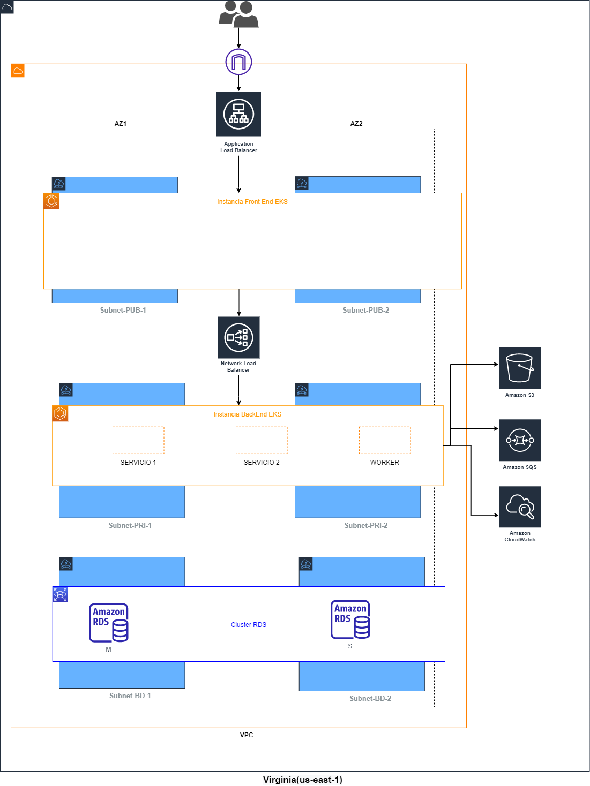
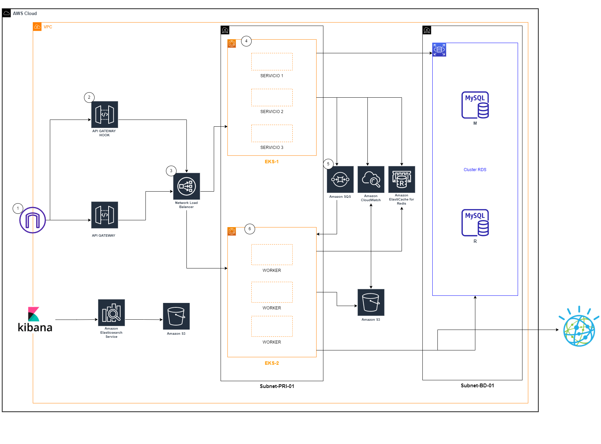
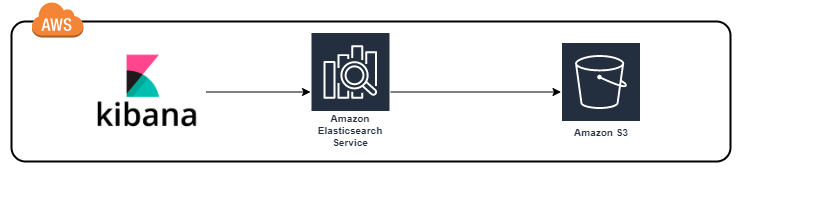

# Prueba Software Engineer Cloud

- Tienes un clúster en nube.
- Se ha desplegado en dicho clúster diversos componentes que se comunican entre ellos de manera síncrona.
- Para poder utilizar las funcionalidades de los componentes, se exponen APIs
- Un componente almacena cierta información de manera temporal en REDIS, y durante cada invocación a parte de almacenar existe otro componente que borra dicha información.
- Otro componente se comunica con IBM Watson.
- En PRD durante el uso de los APIs se observa que luego de 100 invocaciones secuenciales el API deja de contestar, y se tiene previsto que pueda soportar 1000 invocaciones secuenciales y 100 de manera paralela
- La aplicación necesita recolectar información que es ingresada por el cliente y de otras fuentes de información en línea para luego generar archivos en Batch de manera estructura para los usuarios finales. Estos archivos mes a mes puedan llegar a crecer debido a la alta demanda o uso de la aplicación pudiendo llegar a un tamaño de 400 MB
- Actualmente no se cuenta con un visor de auditoria/logs de lo que se ejecuta en los componentes en PRD
- El despliegue es manual entre los entornos (DEV->UAT->PRD)
- Cada vez que desplegamos en PRD a veces no se incluyen cambios certificados en ambientes previos

Las preguntas:

- ¿Qué pasos ejecutarías para diagnosticar que podría estar fallando para no soportar la carga de 100 invocaciones secuenciales?
- En base a lo identificado, que propuesta de arquitectura brindarías (proporcionar un gráfico y una breve descripción de como funcionaría la solución), y que sea capaz de soportar las 1000 invocaciones secuenciales y 100 de manera paralela
- Que plantearías con respecto a la recolección, procesamiento y generación de información
- Que propondrías como alternativa para poder ver los logs/auditoría
- Que acciones propondrías para poder evitar el problema de despliegue en PRD

## **Respuesta 1**

---

- Revisión de la arquitectura: Poder revisar a alto nivel y así poder tener mayor panorama de lo definido.

- Revisión de Infraestructura: Configuración de recurso asignado para los distintos componentes.

- Pruebas de Estress: Realizar pruebas de estress a las Apis(medir tiempos de respuesta) y revisión infraestructura.

- Revision de Codigo: De tener deuda técnica, revisar las metricas de la calidad del codigo, test unit y revision de codigo

## **Respuesta 2**

---

Dado el escenario, Elegí como Nube AWS.

Recomendaria usar El modelo de tres capas es una forma lógica de agrupar los componentes que creamos. Está basado en el concepto de que todos los niveles de la aplicación, son una colección de componentes que se proporcionan servicios entre sí o a otros niveles adyacentes.

•**Modularidad**

Permitirá que cada parte de la misma pueda ser manejada independientemente de las demás.

Los equipos puedan centrarse en los diferentes niveles de la aplicación y los cambios ejecutados lo mas rápidamente posible.

No ayuda a recuperarnos rápidamente de un desastre inesperado, centrándonos únicamente en la parte defectuosa.

•**Escalabilidad**

Buscar el escalar horizontalmente para soportar el tráfico y solicitar la demanda que llega.

AWS cuenta con servicios autogestionados que trabajan según la demanda que tengan.

•**Alta Disponibilidad**

Es un centro de datos tradicional, nuestra aplicación se encuentra en un lugar geográfico.

Con AWS, podemos diseñar nuestra infraestructura para que esté altamente disponible, alojando nuestra aplicación en diferentes puntos conocidos como zonas de disponibilidad.

•**Tolerancia a fallos**

Nuestra infraestructura y aplicación se adapté cómodamente a cualquier cambio inesperado tanto en el tráfico como en las fallas.

Esto se hace normalmente añadiendo un sistema redundante que dará cuenta del aumento de tráfico o fallo cuando ocurra.

 

 

Mejor control presentarse algún problema en algún componente.

La arquitectura soportará la concurrencia en zona de libre disponibilidad que se configure, quiere decir que mínimamente tendrá 2 zonas de disponibilidad y se configura según la configuración que se le brinde en los consumos de recursos; así como tener escalabilidad.

APIs: Propongo usar microservicios reactivos, tiene muchas ventajas, mayor performance en invocaciones secuenciales y paralelismo; así mismo como el uso de recursos y el trabajo de forma asíncrona.

## **GRAFICA**

---

Entrando a detalle adiciono al comportamiento de lo siguiente:

Recordar que la solución esta basada en micro servicios reactivos, necesitamos concurrencia y paralelismo. 

   
1. INTERNET GATEWAY: Quien tiene salida a la red nos permitirá tener expuesto ciertos servicios.

2. API GATEWAY HOOK: Esta api se encargará del punto exposición de apis, como en este sentido yo necesito la informacion para su proceso se encargara de enviar a una cola SQS para su procesamiento.

3. APLICATION LOAD BALANCER: Este servicio es el encargado de poder balancer la carga, según la configuración de recursos que tiene y dirigir a la zona disponible.

4. EKS-1: Este sera un contener que tendrá los distintos micros servicios reactivos, en este escenario el componente de inserción a la cola AWS SQS

5. AMAZON SQS: Dado los distintos caminos que tendremos para la información recomendaría encolar la información dada también la concurrencia.

5. EKS-2: Este será un contenedor de los Workers, que tendrán el comportamiento de escucha a la cola y procesar la información, realizar tratamiento de la información como crea conveniente. También tendrá expuesto sí se necesita a demanda microservicios. Mencionar que todo será realizado con programación reactiva.

6. API GATEWAY: Esta api se encargará del punto exposición de apis, si en tal sentido necesito información a demanda y dejare expuesto.

Recomendaría tener una tabla que genere mes a mes, el sentido sería poblar la tabla con solo 1 índice primario, esto para que luego genere un proceso dicho archivo y almacenarlo en un S3, luego de ello borrar la tabla y volver a generar para no tener problemas lentitud en procesamientos futuros.

## **GRAFICA**

---

## **Respuesta 3**

Recolección: Dejaría APIs y APIs HOOKs ambos reactivos, el primero de trabajar de forma sincrona y el segundo que se encargue de encolar las solicitudes.

Procesamiento: Tendría Worker de escucha a las colas, ya es decisión del negocio utilizar dicha información en los distintos componentes y canales. En este escenario dejaría de respaldo en una base de datos no relacional la información por respaldo y alimentaria dicho archivo en un S3 para su procesamiento.

Generación: De ser a demanda Utilizaría en AWS Cloud Watch asociado a Worker para el procesamiento de la información y lleguen a las fuentes finales necesarias.

## **Respuesta 3**

Existen diferentes herramientas para ello, pero dada la oportunidad recomendaría usar AWS CLOUD WATCH que tiene diferentes opciones, logs, alertas de recursos, entre otros.

Otra alternativa que podría tener es que los logs esten almacenados en un S3 y usaría ELK con KIBANA para usar sus distintas funcionalidades.

## **GRAFICA**

---

## **Respuesta 4**

Elegiría Aws certificate manager, tiene distintas funcionalidades dentro del proceso, asi como notificar sobre vencimientos de alguno de ellos, puede ser alerta previo a la fecha de vencimiento.

Otra opción dado el escenario manual, generaría dentro del proceso la generación de ticket al equipo de monitoreo para la actualización del mismo.

